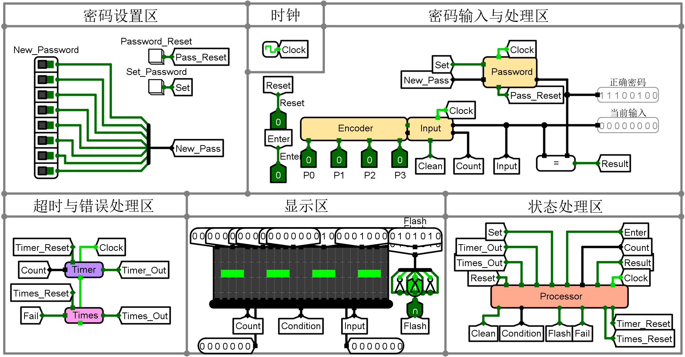

# Logisim-Digital-Lock

> 基于 Logisim 的四位四进制数字密码锁硬件设计

一个使用 Logisim 实现的四位四进制数字密码锁系统，具有完整的密码验证、LED 显示、防抖处理等功能。

## 基本功能

- 支持四位四进制数字密码输入
- LED 点阵显示输入的密码
- 密码输入正确后，长亮 LED
- 密码输入错误后，闪烁 LED
- 支持密码重置
- 支持密码修改
- 超时清空
- 错误次数限制锁定
- 确认按键及清空按键

## 特性

- 清晰的模块化设计
- 便于展示的主电路 (`main`) 及高度封装的顶层电路 (`TOP`)
- 直观的 LED 点阵显示
- 可拓展的字库及词库
- 输入按键长按防抖（防止一次点击多次输入）

## 使用说明

1. 用 Logisim 打开 `Locker.circ` 文件
2. 将时钟频率设置为 `200Hz` 并启用时钟连续和自动仿真
3. 在 `TOP` 电路中，使用戳工具（手指）点击输入按键进行密码输入（按钮 0 1 2 3）和确定（E, Enter）和清空（C, Clear）
4. 初始密码为 `0000`，右键 LED 旁黑色区域 `查看main` 可以进行密码的设置（拨码器设置并点击 `Set_Password`）以及重置（重置为 `0123`）

## 文件说明

- [`Fonts.txt`](./Fonts.txt) - 用于导入到 `Word_Mapper` 模块的字库 ROM 中
- [`Words.txt`](./Words.txt) - 用于导入到 `Alpha_Mapper` 模块的词库 ROM 中

## 展示图

### 主电路图

*主电路用于展示各个模块的连接和功能实现*

### 顶层电路图

*高度封装的顶层电路，便于整体功能的实现和展示，以及团队成员的署名*